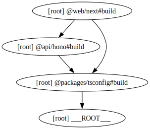

# ZeroStarter - The SaaS Starter

A modern, type-safe, and high-performance SaaS starter template built with a monorepo architecture.

<!--
```bash
npx turbo run build --graph=graph.svg
sed -i '' 's/\[root\] //g; s/#build//g; s/___ROOT___/ZeroStarter/g' graph.svg
mkdir -p .github/assets
mv graph.svg .github/assets/graph-build.svg
```
-->



---

## Tech Stack

- **Runtime & Build System**: [Bun](https://bun.sh) + [Turborepo](https://turbo.build)
- **Frontend**: [Next.js 16](https://nextjs.org)
- **Backend**: [Hono](https://hono.dev)
- **RPC**: [Hono Client](https://hono.dev/docs/guides/rpc) for end-to-end type safety with frontend client
- **Database**: [PostgreSQL](https://www.postgresql.org) with [Drizzle ORM](https://orm.drizzle.team)
- **Authentication**: [Better Auth](https://better-auth.com)
- **Styling**: [Tailwind CSS](https://tailwindcss.com)
- **UI Components**: [Shadcn UI](https://ui.shadcn.com)
- **Data Fetching**: [TanStack Query](https://tanstack.com/query/latest)
- **Validation**: [Zod](https://zod.dev)
- **Linting & Formatting**: [Oxlint](https://oxc.rs/docs/guide/usage/linter) + [Prettier](https://prettier.io)
- **Documentation**: [Fumadocs](https://fumadocs.dev) with auto-generated [llms.txt](https://zerostarter.dev/llms.txt)

### Future Stack and Features

- **AI**
  - [ ] [Vercel AI SDK](https://ai-sdk.dev)
- **Analytics**:
  - [ ] [Posthog](https://posthog.com)
- **Background Tasks**:
  - [ ] [Inngest](https://www.inngest.com)
  - [ ] [Trigger.dev](https://trigger.dev)
- **Email**:
  - [ ] [Resend](https://resend.com)
  - [ ] [SendGrid](https://sendgrid.com)
- **OpenAPI**:
  - [ ] [Scalar](https://scalar.com)
- **Organization/teams**:
  - [ ] [Better Auth](https://www.better-auth.com/docs/plugins/organization)
- **Internationalization**:
  - [ ] [i18next](https://www.i18next.com)
  - [ ] [next-intl](https://next-intl.dev)
- **Payment Processing**:
  - [ ] [Autumn](https://useautumn.com)
  - [ ] [Creem](https://www.creem.io)
  - [ ] [Dodo](https://dodopayments.com)
  - [ ] [Lemon Squeezy](https://www.lemonsqueezy.com)
  - [ ] [Paddle](https://www.paddle.com)
  - [ ] [Polar](https://polar.sh)
  - [ ] [Razorpay](https://razorpay.com)
  - [ ] [Stripe](https://stripe.com)

---

## 📂 Project Structure

This project is a monorepo organized as follows:

```
.
├── api/
│   └── hono/      # Backend API server (Hono)
├── web/
│   └── next/      # Frontend application (Next.js)
└── packages/
    ├── auth/      # Shared authentication logic (Better Auth)
    ├── db/        # Database schema and Drizzle configuration
    ├── env/       # Type-safe environment variables
    └── tsconfig/  # Shared TypeScript configuration
```

---

## 🔌 Type-Safe API Client

This starter utilizes [Hono RPC](https://hono.dev/docs/guides/rpc) to provide end-to-end type safety between the backend and frontend.

- **Backend**: Routes defined in `api/hono/src/routers` are exported as `AppType` at `api/hono/src/index.ts`.
- **Frontend**: The client at `web/next/src/lib/api/client.ts` infers `AppType` request/response types using `hono/client`.

### Usage Example

```ts
import { apiClient } from "@/lib/api/client"

// Fully typed request and response
const res = await apiClient.health.$get()
const data = await res.json()
```

---

## 🤝 Contributing

- Contributions are welcome! Please feel free to submit a Pull Request.
- For local setup of project plz follow [Contributing.md](https://github.com/nrjdalal/zerostarter/contributing.md)


## 📄 License

This project is licensed under the [MIT](LICENSE.md) License.
